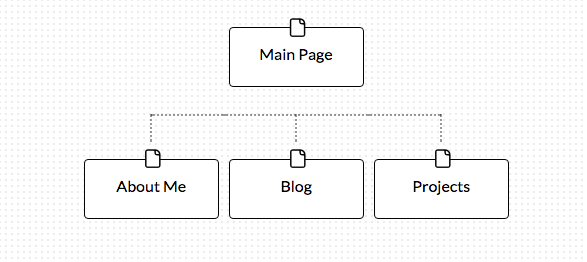

The six phases of web design are: information gathering, planning, design, development, testing/delivery, and maintenance.

The goal of my site is to display my skills and information about myself to potential employers. My site will feature projects I have done, information about me, and a link to my blog.

My target audience, potential employers, is interested in seeing somebody who is passionate and skilled. I plan to prominently display projects I am proud of, as well as information to allow them to get to know me.

When a potential employer comes to my site, I want them to view my portfolio and then have easy access to contact me.

Simply put, User Experience is how a website makes a person feel. A website with good UX is easy to use and pleasant to look at. UX should be designed to appease the target demographic of a site.

UX design is the creation of the visual experience on a website or app. It is important because a page that is appealing to look at and easy to navigate can be the difference in a user sticking around and making the desired conversion, or leaving the page.

The directions for adding an inline image to a file are not sufficient and that made it difficult to complete the challenge.