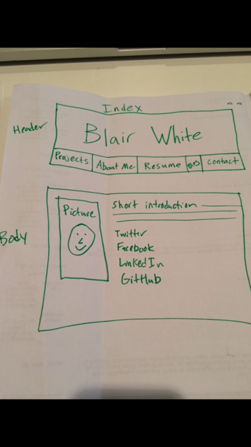
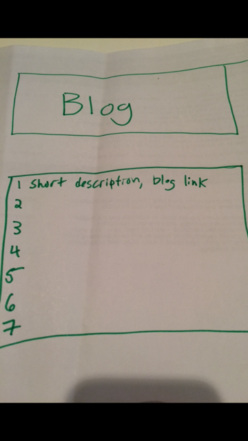

1. A wireframe is a basic layout of a site that allows you to plan how you want a user to process the information presented. It is a simple diagram that lays out header/body/footer, as well as buttons and links.

2. Wireframing is useful because it can be helpful to decide what content a page will feature and where it will go - without the distractions of color or typeface.

3. Wireframing my site was very simple but it was enjoyable to think about what I might place on my site.

4. I stuck with my original idea for this wireframe. I dont think that will always be the case because most sites become very complicated and will require multiple drafts.

5. This challenge was very straightforward and I did not have any questions.

6. I had some trouble getting digital wireframing services to cooperate so I ended up just drawing mine on paper.