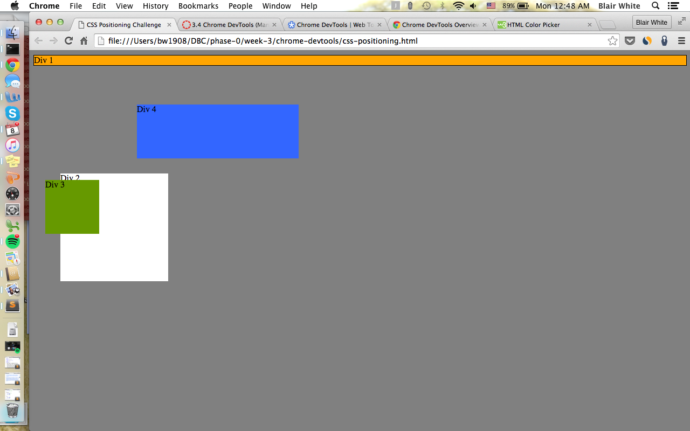
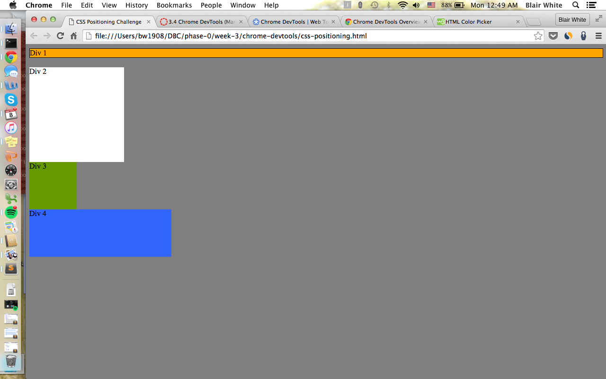
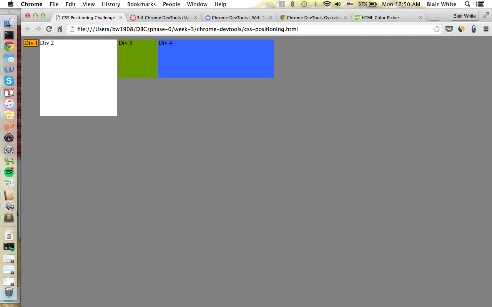
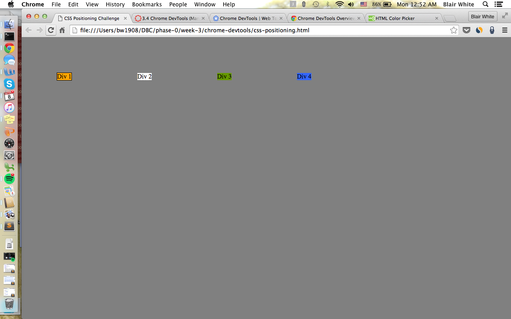
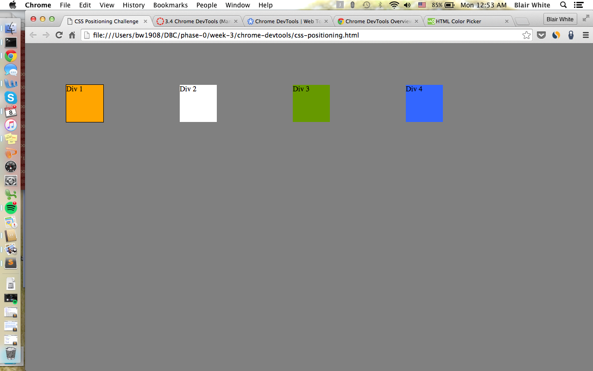
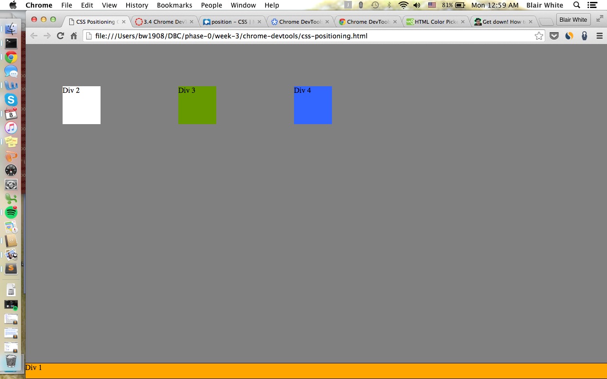
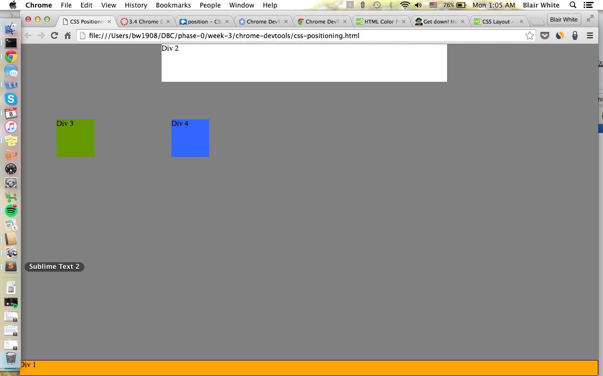
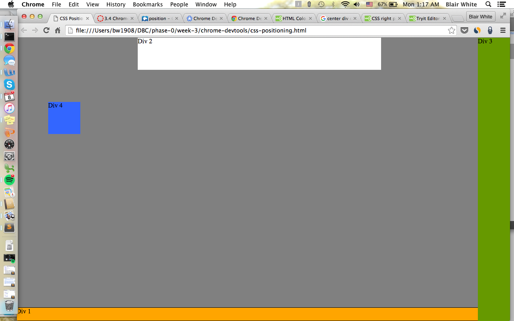
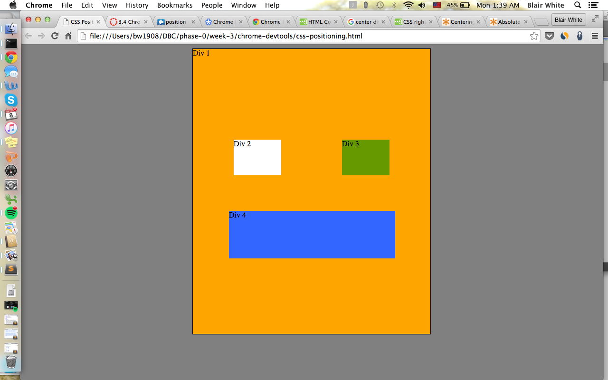

<!DOCTYPE html>
<html>
  
  
  
  
  
  
  
  
  

Chrome's Devtools allows you to see everything in one DOM tree. It allows you to inspect elements, debug code, and improve positioning.

You can resize elements on the DOM using CSS by changing the element rules in the style window.

Static positioning is the default setting, elements are laid out in current position in flow.
Absolute positioning doesn't leave positioning for the element, rather it is positioned relative to its closest positioned ancestor or to the containing block.
Relative positioning lays out elements without regarding position, and then adjusts the position without changing layout.
Fixed positioning is relative to screen's viewport and doesn't move when the user scrolls. I found absolute positioning easiest to use. I am not sure I fully understand fixed position or how it works.

Margin is the distance around the outer border of an element. Border is the width of the outer border. Padding is the distance around an element to its border.

I thought this challenge could have done a better job of introducing DevTools and giving a broad explanation of how to use them, as well as some examples.

<html>